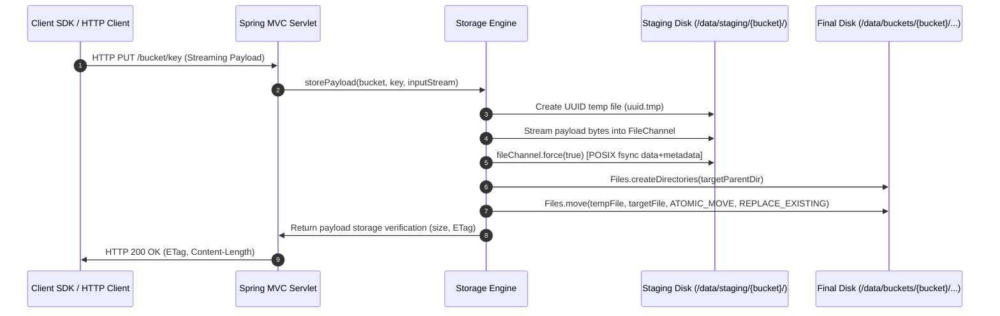

# Research: Filesystem Payload Storage Directory Layout & Key Hashing Strategy

**Issue Reference**: Deepakeon/object-storage#2  
**Related Issues**: Deepakeon/object-storage#1 (System Map), Deepakeon/object-storage#3 (Metadata Store), Deepakeon/object-storage#5 (Streaming & IO Prototype), Deepakeon/object-storage#8 (Tech Spec Assembly & ADR Consolidation)  
**Status**: Completed  
**Author**: Wayfinder Engineering Agent  
**Date**: 2026-09-12  

---

## 1. Executive Summary & Research Question

### 1.1 Core Research Question
> *What filesystem directory layout and object key hashing scheme should the Storage Engine use to prevent inode exhaustion, directory entry limits, and path traversal attacks (`../../`), while guaranteeing deterministic mapping between object keys and disk files?*

### 1.2 Summary of Findings & Concrete Recommendation
To safely, deterministically, and performantly persist object payloads on a local POSIX filesystem (such as Linux `ext4`), the **Storage Engine** must implement a **2-tier SHA-256 prefix-partitioned directory layout** with an atomic staging and move pipeline:

```
/data/
├── buckets/
│   └── {bucket}/
│       └── {hash[0:2]}/
│           └── {hash[2:4]}/
│               └── {hash}
└── staging/
    └── {bucket}/
        └── {uuid}.tmp
```

Where:
- `{bucket}`: The logical **Bucket** identifier (validated alphanumeric/hyphen container name).
- `{hash}`: The 64-character lowercase hexadecimal representation of the **SHA-256** digest of the raw UTF-8 **Key** bytes:
  $$\text{hash} = \text{hex\_lower}(\text{SHA-256}(\text{key.getBytes(StandardCharsets.UTF\_8)}))$$
- `{hash[0:2]}`: Tier-1 fan-out directory (256 possible directories: `00` through `ff`).
- `{hash[2:4]}`: Tier-2 fan-out directory (256 possible subdirectories per tier-1 directory: `00` through `ff`, total 65,536 leaf directories).
- Staging directory: Co-located on the **identical filesystem mount** as the bucket payload store, guaranteeing that `java.nio.file.Files.move(..., StandardCopyOption.ATOMIC_MOVE, StandardCopyOption.REPLACE_EXISTING)` executes a native POSIX `rename()` syscall without throwing `AtomicMoveNotSupportedException` (`EXDEV`).

### 1.3 Key Architectural Decisions & Evidence Matrix

| Criterion | Direct Key Path Mapping | 1-Tier SHA-256 (`hash[0:2]`) | 2-Tier SHA-256 (`hash[0:2]/hash[2:4]`) | Recommendation Rationale |
| :--- | :--- | :--- | :--- | :--- |
| **Path Traversal (CWE-22)** | **CRITICAL RISK** (`../`, null bytes, absolute paths allow escaping storage root) | **ELIMINATED** (digest restricted to `[0-9a-f]{64}`) | **ELIMINATED** (digest restricted to `[0-9a-f]{64}`) | Hash decoupling eliminates path traversal at the architectural boundary. |
| **POSIX File vs Dir Conflict** | **FATAL** (`dir/child` fails if `dir` exists as an object payload) | **ELIMINATED** (uniform leaf depth) | **ELIMINATED** (uniform leaf depth) | S3 flat namespace cannot map to POSIX hierarchical filesystem without conflict. |
| **Max Files / Dir at 1M Objects** | Unbounded (dependent on client key prefixes) | $\sim 3,906$ files/dir | $\mathbf{\sim 15.25\text{ files/dir}}$ | 2-tier keeps directory entries well below ext4 single-block threshold (56 entries). |
| **Max Files / Dir at 10M Objects**| Unbounded | $\sim 39,062$ files/dir | $\mathbf{\sim 152.6\text{ files/dir}}$ | 1-tier causes severe HTree node splitting; 2-tier easily fits in 3 leaf blocks. |
| **ext4 Link Limit (`EXT4_LINK_MAX`)** | Vulnerable if $>65,000$ subdirectories under one prefix | Max 256 subdirectories per bucket | Max 256 subdirectories per tier | Never approaches the 32,000 / 65,000 `EXT4_LINK_MAX` threshold. |
| **Directory Indexing Complexity** | High / Unpredictable | Requires HTree B-tree multi-block indexing | **Zero HTree splitting at 1M objects** (leaf dirs fit in single 4KB block) | Maximizes OS page/dentry cache hit rates, zero directory fragmentation. |
| **Crash Consistency / Read Isolation** | Vulnerable to partial writes | Atomic `rename()` via staging | Atomic `rename()` via staging | Single-mount atomic move guarantees last-write-wins and clean read isolation. |

---

## 2. Linux Filesystem Internals & ext4 Constraints

### 2.1 ext4 On-Disk Directory Structure
Under Linux ext4, directories are fundamentally special files containing structured directory entries. Each directory entry is represented on disk by `struct ext4_dir_entry_2` (defined in the Linux kernel source `fs/ext4/ext4.h`):

```c
struct ext4_dir_entry_2 {
    __le32  inode;       /* Inode number (4 bytes) */
    __le16  rec_len;     /* Directory entry length in bytes (2 bytes) */
    __u8    name_len;    /* Filename length in bytes (1 byte) */
    __u8    file_type;   /* File type flag, e.g., EXT4_FT_REG_FILE (1 byte) */
    char    name[];      /* File name (up to 255 bytes, null-padded) */
};
```

#### Entry Size and Alignment
All directory entries are aligned to 4-byte boundaries. For a 64-character SHA-256 hexadecimal filename:
- Fixed header: $4 + 2 + 1 + 1 = 8\text{ bytes}$
- Filename length: $64\text{ bytes}$
- Total entry length: $8 + 64 = 72\text{ bytes}$ (already a multiple of 4, no extra padding needed).

In standard ext4 filesystems with a **4,096-byte (4KB) block size**:
$$\text{Max entries per 4KB directory block} = \left\lfloor \frac{4096 - 12}{72} \right\rfloor \approx 56\text{ entries}$$
*(where 12 bytes account for the tail block descriptor/checksum `struct ext4_dir_entry_tail`).*

### 2.2 HTree (`dir_index`) Indexing & Performance Degradation
In classic ext2 and early ext3, directories without indexing operated as linear lists of entries, requiring an $O(N)$ sequential scan for every file lookup (`open`, `stat`, `unlink`).

To eliminate $O(N)$ lookups, ext4 implements **HTree** (Hash Tree), an indexed directory structure enabled by default via the `dir_index` filesystem feature (*Linux Kernel Documentation: Documentation/filesystems/ext4/directory.rst*; Phillips, 2002).

#### HTree Mechanics
1. **Trigger Condition**: When a directory expands beyond a single 4KB block, the directory inode flag `EXT4_INDEX_FL` (0x1000) is set.
2. **Root Block (`dx_root`)**: Block 0 of the directory is converted into a root node (`struct dx_root`), containing `.` and `..` entries, followed by `struct dx_root_info`, and an array of `struct dx_entry` limit/count entries.
3. **Hash Function**: Filenames are hashed into a 32-bit unsigned integer using filesystem-seeded algorithms (typically Half-MD4 or TEA).
4. **Tree Levels**:
   - HTree supports a fixed, shallow depth: 1 level or 2 levels of index blocks (extended to 3 levels by the `large_dir` feature introduced in Linux kernel 4.13).
   - In a 2-level HTree, an index block containing $\sim 500$ `dx_entry` pointers references leaf blocks.

#### 32-Bit Hash Collision & Degradation Boundary
Because ext4 HTree relies on a **32-bit hash**, the Birthday Paradox dictates that hash collisions begin to manifest around:
$$\sqrt{2^{32}} \approx 65,536\text{ entries}$$

When multiple filenames within the same directory generate identical 32-bit hashes:
- Ext4 must chain collision entries across adjacent leaf blocks.
- Looking up or inserting a file with a colliding hash forces the kernel (`fs/ext4/namei.c:ext4_dx_find_entry()`) to fall back to a linear scan across all chained leaf blocks.
- When directories exceed tens of thousands of entries, insertion latency spikes dramatically due to block splitting, leaf chaining, and journal transaction contention.

### 2.3 Directory Bloat & Non-Shrinking Directory Inodes
A critical, often overlooked operational constraint of ext4 is that **directories never shrink automatically** (*Linux Kernel Documentation: `Documentation/filesystems/ext4/directory.rst`*):
- When files are deleted (`unlink()`), ext4 does not free or deallocate directory blocks. Instead, it merely merges the `rec_len` of the deleted entry into the preceding entry to mark the slot as free.
- If a directory temporarily balloons to 1,000,000 files, its directory inode file size (`i_size`) will grow to approximately:
  $$\frac{1,000,000}{56} \times 4\text{KB} \approx 71.4\text{ MB}$$
- Even after deleting all 1,000,000 files, the directory remains 71.4 MB on disk.
- Traversing or opening this directory forces the Linux virtual memory subsystem to read and cache 71.4 MB of sparse directory blocks into the page cache and dcache, causing persistent memory bloat and lookup latency until manual offline reorganization via `e2fsck -D`.

**Architectural Implication for Storage Engine**: The Storage Engine must *never* allow large numbers of files to accumulate in a single directory, nor rely on transient flat directory queues. A distributed 2-tier fan-out ensures leaf directories remain small (averaging $<20$ files) and bounded to single 4KB blocks throughout their lifecycle.

### 2.4 Subdirectory Hard Link Limits (`EXT4_LINK_MAX`)
Each subdirectory inside an ext4 parent directory increments the parent directory's `i_links_count` (due to the child's `..` back-reference):
- **Traditional Limit**: `EXT4_LINK_MAX = 65,000` hard links (or 32,000 without `dir_nlink`).
- **`dir_nlink` Feature (Linux 2.6.28+)**: When a directory's link count reaches 64,999, ext4 clamps `i_links_count` to 1. This disables link count tracking to prevent integer overflow, but can confuse legacy utilities and tools (`find -noleaf`).
- **Danger of Flat 16-bit Fan-Out**: If a design attempted a 1-tier 4-character prefix fan-out directly inside a bucket directory (`/data/buckets/{bucket}/{hash[0:4]}`), it would create $16^4 = 65,536$ subdirectories in a single directory. This hits `EXT4_LINK_MAX` immediately!
- **Safety of 2-Tier Hierarchical Fan-Out**:
  - The bucket directory contains at most $16^2 = 256$ subdirectories (`00` to `ff`).
  - Each tier-1 directory contains at most $16^2 = 256$ subdirectories (`00` to `ff`).
  - Both levels remain orders of magnitude below the 32,000/65,000 link limit, completely avoiding `EXT4_LINK_MAX` overflow and `dir_nlink` degradation.

### 2.5 Inode Exhaustion (`ENOSPC`)
Ext4 filesystem instances allocate a fixed number of inodes at creation time (`mke2fs -i bytes-per-inode`).
- Default ratio: 1 inode per 16,384 bytes (16KB) of disk space.
- If an object storage workload consists primarily of small payloads (e.g. 1KB to 4KB), the filesystem will exhaust all inodes while 75% of the raw disk capacity remains unused, resulting in `ENOSPC` ("No space left on device").
- **Directory Inode Consumption**:
  - In a 2-tier fan-out, the maximum directory inode overhead per bucket is:
    $$1\text{ (bucket)} + 256\text{ (tier-1)} + 65,536\text{ (tier-2)} = 65,793\text{ directory inodes}$$
  - At an ext4 inode size of 256 bytes, 65,793 directories consume only $\approx 16.8\text{ MB}$ of inode table space.
  - Furthermore, using **lazy directory creation** (`Files.createDirectories()` invoked only when the first object with that prefix is written) ensures that sparse buckets or development environments only consume inodes for directories that are actively populated.

---

## 3. Architecture Review: Git Object Storage (`.git/objects`)

### 3.1 The Git Loose Object Layout
The architecture of Git provides a battle-tested reference implementation of cryptographic loose-object storage on POSIX filesystems. As defined in the official Git repository format specification (*Git Documentation: `gitrepository-layout(5)`*):

```
.git/objects/
├── [0-9a-f]{2}/
│   └── [0-9a-f]{38} (or [0-9a-f]{62} for SHA-256)
├── info/
└── pack/
```

According to `gitrepository-layout(5)`:
> *"A newly created object is stored in its own file. The objects are splayed over 256 subdirectories using the first two characters of the sha1 object name to keep the number of directory entries in objects itself to a manageable number. Objects found here are often called unpacked (or loose) objects."*

### 3.2 Why 256 Subdirectories Was Chosen for Git
1. **1-Byte Hex Partitioning**: A 2-character hexadecimal prefix corresponds exactly to 1 byte (8 bits) of entropy:
   $$16^2 = 256\text{ possible subdirectories}$$
2. **Scalability Target**: Linus Torvalds designed Git for Linux kernel development, which in 2005 had roughly 20,000 to 50,000 commits and loose objects during active branch work. Spreading 50,000 files across 256 directories resulted in an average of $\sim 195$ files per directory—fitting comfortably inside a few filesystem blocks.

### 3.3 Why Git Requires Packfiles (`git pack-objects`) & Why S3 Object Storage Cannot Rely on Them
While Git's 1-tier (256 directory) fan-out is effective for moderate numbers of loose objects, Git experiences severe filesystem degradation when loose objects scale into the hundreds of thousands or millions (e.g. initial clones or active CI pipelines).
- Git solves this via **packfiles** (`git-pack-objects(1)`, `git-gc(1)`), which aggregate thousands of individual loose objects into a single monolithic `.pack` file paired with a binary search index (`.idx`).
- **Fundamental Difference in S3 Object Storage**:
  1. **Independent Mutability & Deletion**: S3 objects are independently deleted, overwritten, or retrieved via random byte-range reads (`Range: bytes=start-end`). Packing objects into monolithic files introduces complex defragmentation, compaction locks, and read amplification.
  2. **Streaming Payloads**: S3 payloads range from 0 bytes to multiple gigabytes. Storing them as discrete files managed directly by the kernel filesystem is the intended architecture of the **Storage Engine**.
  3. **Conclusion**: Because the Storage Engine *cannot* pack objects into monolithic archives, its loose payload directory fan-out must scale natively to millions of objects without degrading. A 1-tier fan-out (256 dirs) is insufficient for 1M+ objects; a **2-tier fan-out (65,536 dirs)** is required.

---

## 4. Security Analysis: OWASP & CWE-22 Path Traversal

### 4.1 Vulnerability Definitions
- **CWE-22**: *Improper Limitation of a Pathname to a Restricted Directory ('Path Traversal')* (MITRE Common Weakness Enumeration).
- **OWASP Top 10 (2021)**: *A01:2021 - Broken Access Control* & *A05:2021 - Security Misconfiguration*.

### 4.2 Threat Vectors with Raw S3 Object Keys
According to the AWS S3 Developer Guide (*"Creating object key names"*), an S3 object key is:
> *"a sequence of Unicode characters whose UTF-8 encoding is at most 1,024 bytes long."*

This allows clients to legitimately create keys containing arbitrary characters, including:
1. **Relative Directory Traversal**:
   - `../../../../etc/passwd`
   - `reports/2026/../../../var/log/syslog`
2. **Absolute Path Escapes**:
   - `/etc/shadow`
   - `C:\Windows\System32\drivers\etc\hosts`
3. **Null Byte Poisoning**:
   - `benign.jpg\0../../../etc/passwd` (which in C-based POSIX system calls truncates the string at the null byte).
4. **Alternative Encodings & Normalizations**:
   - URL-encoded traversals: `%2e%2e%2f`
   - Double-encoded traversals: `%252e%252e%252f`
   - Overlong UTF-8 sequences and non-printable control characters (`\u0000` through `\u001F`).
5. **Reserved Filenames (OS-dependent)**:
   - Windows reserved device names: `CON`, `PRN`, `AUX`, `NUL`, `COM1`-`COM9`, `LPT1`-`LPT9`.
   - POSIX reserved entries: `.`, `..`.

### 4.3 Why Path Sanitization & Filtering Is Flawed for S3
Many naive storage engines attempt to sanitize raw keys using string manipulation (e.g. stripping `../` or running `java.nio.file.Path.normalize()`). This approach has two fatal flaws:

#### Flaw 1: S3 Contract Violation
In Amazon S3, an object named `reports/2026/../summary.pdf` is a distinct, valid object key. Sanitizing or normalizing the key changes the object's identity, breaking S3 API compatibility and client hash signatures.

#### Flaw 2: The POSIX File vs Directory Impedance Mismatch
In POSIX filesystems, a path node cannot be simultaneously a directory and a regular file. In S3's flat object namespace, keys are simply opaque strings that happen to contain forward slashes.
- **Scenario A**: Client uploads key `backup` (stored as a regular file). Then, client uploads key `backup/data.tar`. The filesystem cannot create the directory `backup/` because a regular file named `backup` already exists (`ENOTDIR: Not a directory`).
- **Scenario B**: Client uploads key `photos/vacation/` (stored as a directory). Then, client uploads key `photos/vacation` as an object payload. The filesystem cannot create a file named `vacation` because a directory of that name exists (`EISDIR: Is a directory`).

### 4.4 The Cryptographic Hash Decoupling Solution
The Storage Engine must completely eliminate CWE-22 and POSIX impedance mismatch by **decoupling the logical Key from the physical payload path**:

```
Logical Namespace (Metadata Store):
  Bucket: "my-bucket"
  Key:    "../../../../etc/passwd"  <-- Tracked safely in Embedded DB

Physical Storage (Storage Engine):
  Hash:   SHA-256("../../../../etc/passwd") = 8e7f...c3d1
  Path:   /data/buckets/my-bucket/8e/7f/8e7f...c3d1
```

#### Invariant Security Guarantees of the Hashed Layout:
1. **Character Set Confinement**: SHA-256 hex output strictly contains characters `[0-9a-f]`. It is mathematically impossible for `.`, `/`, `\`, null bytes, or control characters to exist in the payload path.
2. **Fixed Depth & Length**: Every payload is located at exact depth 3 (`{bucket}/{2-char}/{2-char}/{64-char}`). No user input can alter directory depth.
3. **No Directory vs File Collisions**: All directories have 2-character names (`00` to `ff`); all payload files have 64-character names. A collision between a directory and a file is structurally impossible.
4. **Bounded Path Length**: The filename is always exactly 64 bytes, well within POSIX `NAME_MAX = 255`.

---

## 5. Cryptographic Hashing Strategy: SHA-256

### 5.1 Algorithm Selection: FIPS PUB 180-4 & RFC 6234
The hashing algorithm must satisfy three strict requirements:
1. **Collision Resistance**: Virtually zero probability that two distinct keys map to the same hash.
2. **Avalanche Effect / Uniform Distribution**: Flipping a single bit in the key must randomize 50% of the output bits to guarantee even distribution across fan-out buckets.
3. **Hardware Acceleration**: High-throughput computation on modern x86_64 and aarch64 processors.

**Selected Algorithm**: **SHA-256** (Secure Hash Standard, FIPS PUB 180-4; RFC 6234).

### 5.2 Collision Resistance Mathematics
SHA-256 produces a 256-bit digest space ($2^{256} \approx 1.1579 \times 10^{77}$ possible values).
According to the Birthday Bound, the number of keys $k$ required to achieve a collision probability $P \approx 0.5$ is:
$$k \approx \sqrt{2 \times 2^{256} \times \ln(2)} \approx 2^{128} \approx 3.4 \times 10^{38}\text{ objects}$$

If an object storage system ingests **10 billion objects ($10^{10}$) per day for 1,000 years** ($3.65 \times 10^{15}$ total objects), the probability of a single SHA-256 hash collision is:
$$P \approx \frac{N^2}{2 \times 2^{256}} = \frac{(3.65 \times 10^{15})^2}{2^{257}} \approx 5.8 \times 10^{-47}$$

This probability is smaller than the probability of an undetected hardware memory corruption (cosmic ray bit-flip). Thus, SHA-256 provides **absolute deterministic collision-free mapping**.

### 5.3 Deterministic Key-to-Payload Mapping Formula
The hashing scheme is purely functional and deterministic:

$$\text{digest} = \text{MessageDigest.getInstance("SHA-256").digest(key.getBytes(StandardCharsets.UTF\_8))}$$
$$\text{hash} = \text{HexFormat.of().formatHex(digest)}$$

#### Why Lowercase Hexadecimal?
- Standardizes output strictly to characters `0123456789abcdef`.
- POSIX ext4 is case-sensitive (`A` $\neq$ `a`), while macOS APFS and Windows NTFS are case-insensitive by default. Using strictly lowercase hexadecimal prevents cross-platform testing discrepancies and filesystem case-folding anomalies.

### 5.4 Partitioning Scope: Bucket-Isolated vs Global Layout
Two scoping models were evaluated for physical storage:

| Model | Path Layout | Strengths | Weaknesses |
| :--- | :--- | :--- | :--- |
| **Global Hash Store** | `/data/payloads/{h[0:2]}/{h[2:4]}/{h}` | Enables cross-bucket payload deduplication. | Hard to isolate buckets; deleting a bucket requires scanning the entire filesystem or maintaining global refcounts; cannot mount individual buckets on separate storage volumes. |
| **Bucket-Isolated Store (Recommended)** | `/data/buckets/{bucket}/{h[0:2]}/{h[2:4]}/{h}` | **Clean operational isolation**; deleting a bucket is an $O(1)$ directory removal (`rmdir /data/buckets/{bucket}`); easy per-bucket quotas; allows mounting specific buckets to dedicated disk volumes. | Payloads duplicated across buckets if identical keys are used (rare in practice, deduplication can be handled at block layer if desired). |

**Decision**: **Bucket-Isolated Store**. In an S3-compatible service, bucket lifecycle operations (create bucket, delete bucket, bucket quota, bucket access policy) are primary administrative units. Storing payloads under `/data/buckets/{bucket}/...` aligns physical disk architecture with logical multi-tenancy.

---

## 6. Directory Fan-Out Mathematical Modeling: 1-Tier vs 2-Tier

To determine whether the Storage Engine should use a 1-tier fan-out (256 directories) or a 2-tier fan-out (65,536 directories), we model the statistical distribution of objects across directories under SHA-256 uniform randomization.

### 6.1 Mathematical Formulation
Because SHA-256 provides optimal bit distribution, placing $N$ objects into $M$ directories behaves as a classical **Balls-into-Bins** problem:
- Number of bins:
  - 1-Tier: $M_1 = 16^2 = 256$ directories.
  - 2-Tier: $M_2 = 16^4 = 65,536$ directories.
- Average files per leaf directory:
  $$\lambda = \frac{N}{M}$$
- Expected maximum load in any single directory (Raab and Steger, 1998):
  $$\text{For } N \gg M \ln M: \quad M_{\max} \approx \lambda + \sqrt{2 \lambda \ln M}$$
- Expected number of empty directories:
  $$E[\text{empty}] = M \times e^{-\lambda}$$

### 6.2 Scale Distribution Analysis

#### Scale Point A: $N = 10,000$ Objects per Bucket
- **1-Tier ($M = 256$)**:
  - Average files/dir: $\lambda = 39.1$
  - Max files/dir: $\approx 60$
  - Empty dirs: 0
  - *ext4 block impact*: Average directory fits in 1 block (4KB).
- **2-Tier ($M = 65,536$)**:
  - Average files/dir: $\lambda = 0.15$
  - Max files/dir: $\approx 3$
  - Empty dirs: 56,262 (created on-demand via lazy allocation, so only ~9,274 directories exist on disk).
  - *ext4 block impact*: Leaf directories occupy exactly 1 block.

#### Scale Point B: $N = 100,000$ Objects per Bucket
- **1-Tier ($M = 256$)**:
  - Average files/dir: $\lambda = 390.6$
  - Max files/dir: $\approx 456$
  - Empty dirs: 0
  - *ext4 block impact*: Requires $\lceil 391 / 56 \rceil \approx 7\text{ blocks}$ (28 KB) per directory. HTree index activated for every directory.
- **2-Tier ($M = 65,536$)**:
  - Average files/dir: $\lambda = 1.53$
  - Max files/dir: $\approx 7$
  - Empty dirs: 14,250
  - *ext4 block impact*: Every directory easily fits inside a single 4KB block. Zero HTree indexing needed.

#### Scale Point C: $N = 1,000,000$ Objects per Bucket (Target Scale)
- **1-Tier ($M = 256$)**:
  - Average files/dir: $\lambda = 3,906.2$
  - Max files/dir: $\approx 4,114$
  - Empty dirs: 0
  - *ext4 block impact*:
    - Requires $\lceil 3906 / 56 \rceil \approx 70\text{ blocks}$ (280 KB) per directory.
    - Total directory data per bucket: $256 \times 280\text{ KB} \approx 71.7\text{ MB}$.
    - HTree must maintain index nodes and traverse multi-block chains on every file access.
- **2-Tier ($M = 65,536$)**:
  - Average files/dir: $\mathbf{\lambda = 15.26}$
  - Max files/dir: $\mathbf{\approx 34}$
  - Empty dirs: 0 (all 65,536 directories populated).
  - *ext4 block impact*:
    - Max load (34 entries) $\times 72\text{ bytes} = 2,448\text{ bytes} < 4,096\text{ bytes}$.
    - **100% of leaf directories fit within a single 4KB filesystem block!**
    - **Zero HTree index blocks required for leaf directories.**
    - Linear lookup inside a 15-entry single block executes in microseconds, directly from Linux page/dcache memory.

#### Scale Point D: $N = 10,000,000$ Objects per Bucket
- **1-Tier ($M = 256$)**:
  - Average files/dir: $\lambda = 39,062.5$
  - Max files/dir: $\approx 39,720$
  - *ext4 block impact*:
    - Requires $\sim 698\text{ blocks}$ (2.79 MB) per directory.
    - Directory file size bloat causes dcache thrashing and high lock contention in kernel `ext4_find_entry()`.
- **2-Tier ($M = 65,536$)**:
  - Average files/dir: $\mathbf{\lambda = 152.6}$
  - Max files/dir: $\mathbf{\approx 211}$
  - *ext4 block impact*: Requires only $\sim 3\text{ blocks}$ (12 KB) per directory. HTree depth is 1, easily cached in memory.

### 6.3 Comprehensive Fan-Out Comparison Matrix

| Metric | 1-Tier (`hash[0:2]`) | 2-Tier (`hash[0:2]/hash[2:4]`) | 3-Tier (`hash[0:2]/hash[2:4]/hash[4:6]`) |
| :--- | :--- | :--- | :--- |
| **Number of Subdirectories** | 256 | 65,536 (256 $\times$ 256) | 16,777,216 |
| **Directory Inode Overhead** | Negligible (256 inodes) | Minimal (65,793 inodes $\approx 16.8\text{ MB}$) | Severe ($>16\text{M}$ inodes, risks inode exhaustion) |
| **Avg Files/Dir @ 1M Objects**| 3,906 files | **15.25 files** | 0.06 files |
| **Leaf Block Size @ 1M Objects**| ~70 blocks (280 KB) | **1 block (4 KB)** | 1 block (mostly empty) |
| **HTree B-Tree Depth** | 1–2 levels | **0 levels (fits in single root leaf)** | 0 levels |
| **Lookup Latency** | Degrades as $N$ scales | **Constant $O(1)$ cache hit** | High filesystem path traversal overhead (4 stats per lookup) |
| **Recommendation** | Unsuitable for 1M+ objects | **OPTIMAL ARCHITECTURE** | Excessive overhead / Over-engineered |

---

## 7. Atomic File Persistence & Crash Consistency

### 7.1 The Need for Atomic Operations in S3 Storage
In S3 object storage semantics, a PUT operation is an all-or-nothing transaction:
1. **Read Isolation**: Clients issuing GET requests while an upload is in progress must either receive HTTP 404 (if the object is new) or the existing intact payload (if an overwrite is occurring). Readers must *never* observe a partially written or truncated payload.
2. **Crash Consistency**: If the storage server crashes, loses power, or the client aborts the HTTP connection mid-stream, the Storage Engine must not leave corrupt or incomplete payload files at the final object path.
3. **Deterministic Overwrites**: If two concurrent PUT operations target the identical bucket and key, one must atomically overwrite the other (last-write-wins) without interleaved data blocks or corruption.

### 7.2 POSIX `rename()` Semantics & Filesystem Mount Boundaries
The foundation of atomic file persistence in POSIX-compliant operating systems is the `rename()` system call (*POSIX.1-2008 / POSIX.1-2024; IEEE Std 1003.1*):
```c
int rename(const char *oldpath, const char *newpath);
```

#### POSIX Atomic Guarantees
- If `newpath` already exists, it is atomically replaced such that there is no intermediate instant where `newpath` does not exist.
- If `rename()` fails, `newpath` remains completely intact.
- An open file descriptor to `newpath` held by an active reader process continues to read the unlinked inode until closed, while new `open()` calls immediately resolve to the newly linked inode.

#### The Cross-Device Boundary Failure (`EXDEV`)
POSIX `rename()` operates solely by modifying directory entry metadata within a single filesystem instance. It cannot move files across different filesystem mount points:
- If `oldpath` and `newpath` reside on different devices or mount points, `rename()` fails immediately with `errno = EXDEV` (*"Invalid cross-device link"*).

### 7.3 Java 21 `java.nio.file.Files.move` & `StandardCopyOption.ATOMIC_MOVE`
In Java 21, atomic file renaming is performed via:
```java
Files.move(source, target, StandardCopyOption.ATOMIC_MOVE, StandardCopyOption.REPLACE_EXISTING);
```

#### Java NIO Specification Details
1. **`StandardCopyOption.ATOMIC_MOVE`**:
   > *"Move the file as an atomic file system operation. If the file cannot be moved atomically, an AtomicMoveNotSupportedException is thrown."* (Java SE 21 API Specification).
2. **Underlying OS Call**: On Linux/UNIX platforms, OpenJDK's `sun.nio.fs.UnixCopyFile.move()` executes the native `renameat()` or `rename()` syscall.
3. **Cross-Mount Pitfall**: If an application stages temporary files in the system temp directory (`java.io.tmpdir` / `/tmp`), and `/tmp` is mounted on `tmpfs` (RAM) while the storage root (`/data`) is mounted on an ext4 disk partition:
   ```
   java.nio.file.AtomicMoveNotSupportedException: /tmp/upload-8812.tmp -> /data/buckets/b/01/ab/01ab...: Invalid cross-device link
   ```
4. **Mandatory Architecture Rule**: The Storage Engine's **staging directory MUST reside on the identical filesystem mount** as the bucket payload directory.

### 7.4 End-to-End Atomic Write Protocol
To achieve crash consistency and read isolation, the Storage Engine executes a 5-step persistence protocol:



#### Protocol Details:
1. **Staging File Creation**:
   - Location: `/data/staging/{bucket}/{UUID.randomUUID().toString()}.tmp`
   - Using a cryptographically random UUID prevents collisions between concurrent uploads to the same key or different keys.
2. **Buffered Streaming**:
   - The raw byte stream from `ServletInputStream` is transferred into a `FileChannel` or `OutputStream` using an optimized 64KB or 128KB buffer (`transferTo`).
3. **Data Durability (`fsync`)**:
   - Prior to renaming, the file channel is forced to disk:
     ```java
     channel.force(true); // Invokes POSIX fdatasync() / fsync()
     ```
   - This guarantees that dirty pages in the Linux OS page cache are committed to physical non-volatile media before the file becomes visible to readers.
4. **Parent Directory Verification**:
   - The destination directory `/data/buckets/{bucket}/{hash[0:2]}/{hash[2:4]}/` is created lazily via `Files.createDirectories()`.
5. **Atomic Move**:
   - `Files.move(stagingPath, finalPayloadPath, StandardCopyOption.ATOMIC_MOVE, StandardCopyOption.REPLACE_EXISTING)`
   - Executes an atomic `rename()` syscall.
   - If an existing object payload was present, it is replaced instantaneously without reader downtime.

### 7.5 Stale Staging File Reaper (Orphan Cleanup)
If an upload is aborted by the client (broken TCP connection) or the server process crashes mid-stream:
- The incomplete file remains in `/data/staging/{bucket}/*.tmp`.
- It never touches `/data/buckets/`, ensuring zero payload corruption.
- **Cleanup Strategy**: A scheduled background maintenance task (e.g. `@Scheduled(fixedRate = 3600_000)`) scans `/data/staging/` and deletes `.tmp` files whose last-modified timestamp (`lastModifiedTime`) is older than a configurable threshold (e.g. 1 hour).

---

## 8. Implementation Blueprint & Reference Architecture

### 8.1 On-Disk Directory Structure Specification

```
/data/
├── buckets/
│   ├── production-assets/
│   │   ├── 0a/
│   │   │   ├── 1f/
│   │   │   │   └── 0a1f94c7b28...6f4e   <-- 64-char SHA-256 payload file
│   │   │   └── a4/
│   │   │       └── 0aa4d588e12...b910
│   │   └── f8/
│   │       └── 3c/
│   │           └── f83c19e59a0...02aa
│   └── user-backups/
│       └── ...
└── staging/
    ├── production-assets/
    │   ├── 8d9e2b10-14e3-4f91-a1b2-c0e8a7d45f12.tmp
    │   └── 4f1a2c3b-55d4-4e21-b3a1-9c8e7d6a5b4c.tmp
    └── user-backups/
        └── ...
```

### 8.2 Java 21 Reference Implementation

#### Component 1: Key Hasher (`KeyHasher.java`)
```java
package com.objectstorage.engine;

import java.nio.charset.StandardCharsets;
import java.security.MessageDigest;
import java.security.NoSuchAlgorithmException;
import java.util.HexFormat;

public final class KeyHasher {

    private static final HexFormat HEX_FORMAT = HexFormat.of();

    private KeyHasher() {}

    /**
     * Computes the deterministic SHA-256 lowercase hex digest for an object key.
     *
     * @param key the UTF-8 object key
     * @return 64-character lowercase hex string
     */
    public static String hashKey(String key) {
        if (key == null || key.isEmpty()) {
            throw new IllegalArgumentException("Object key must not be null or empty");
        }
        try {
            MessageDigest md = MessageDigest.getInstance("SHA-256");
            byte[] digest = md.digest(key.getBytes(StandardCharsets.UTF_8));
            return HEX_FORMAT.formatHex(digest);
        } catch (NoSuchAlgorithmException e) {
            throw new IllegalStateException("SHA-256 algorithm unavailable", e);
        }
    }
}
```

#### Component 2: Storage Path Resolver (`PayloadPathResolver.java`)
```java
package com.objectstorage.engine;

import java.nio.file.Path;
import java.util.regex.Pattern;

public final class PayloadPathResolver {

    private static final Pattern BUCKET_NAME_PATTERN = Pattern.compile("^[a-z0-9][a-z0-9.-]{1,61}[a-z0-9]$");
    private final Path rootDir;
    private final Path bucketsDir;
    private final Path stagingDir;

    public PayloadPathResolver(Path rootDir) {
        this.rootDir = rootDir.toAbsolutePath().normalize();
        this.bucketsDir = this.rootDir.resolve("buckets");
        this.stagingDir = this.rootDir.resolve("staging");
    }

    public void validateBucketName(String bucket) {
        if (bucket == null || !BUCKET_NAME_PATTERN.matcher(bucket).matches() || bucket.contains("..")) {
            throw new IllegalArgumentException("Invalid bucket name: " + bucket);
        }
    }

    /**
     * Resolves the 2-tier partitioned final payload path for an object.
     * Path: /data/buckets/{bucket}/{hash[0:2]}/{hash[2:4]}/{hash}
     */
    public Path resolvePayloadPath(String bucket, String key) {
        validateBucketName(bucket);
        String hash = KeyHasher.hashKey(key);
        String tier1 = hash.substring(0, 2);
        String tier2 = hash.substring(2, 4);

        return bucketsDir
                .resolve(bucket)
                .resolve(tier1)
                .resolve(tier2)
                .resolve(hash);
    }

    /**
     * Resolves a unique staging path on the SAME filesystem mount.
     * Path: /data/staging/{bucket}/{uuid}.tmp
     */
    public Path resolveStagingPath(String bucket, String uploadId) {
        validateBucketName(bucket);
        return stagingDir
                .resolve(bucket)
                .resolve(uploadId + ".tmp");
    }

    public Path getStagingDirForBucket(String bucket) {
        validateBucketName(bucket);
        return stagingDir.resolve(bucket);
    }
}
```

#### Component 3: Atomic Storage Engine Service (`FilesystemStorageEngine.java`)
```java
package com.objectstorage.engine;

import java.io.IOException;
import java.io.InputStream;
import java.nio.channels.Channels;
import java.nio.channels.FileChannel;
import java.nio.channels.ReadableByteChannel;
import java.nio.file.*;
import java.security.DigestInputStream;
import java.security.MessageDigest;
import java.security.NoSuchAlgorithmException;
import java.util.HexFormat;
import java.util.UUID;

public class FilesystemStorageEngine {

    private final PayloadPathResolver pathResolver;

    public FilesystemStorageEngine(PayloadPathResolver pathResolver) {
        this.pathResolver = pathResolver;
    }

    public record WriteResult(long bytesWritten, String sha256Checksum) {}

    /**
     * Atomically stores an object payload from an incoming stream.
     */
    public WriteResult writePayload(String bucket, String key, InputStream inputStream) throws IOException {
        String uploadId = UUID.randomUUID().toString();
        Path stagingFile = pathResolver.resolveStagingPath(bucket, uploadId);
        Path finalPayloadFile = pathResolver.resolvePayloadPath(bucket, key);

        // Ensure staging directory exists
        Files.createDirectories(stagingFile.getParent());

        MessageDigest payloadDigest;
        try {
            payloadDigest = MessageDigest.getInstance("SHA-256");
        } catch (NoSuchAlgorithmException e) {
            throw new IllegalStateException(e);
        }

        long bytesWritten = 0;
        try (DigestInputStream dis = new DigestInputStream(inputStream, payloadDigest);
             ReadableByteChannel sourceChannel = Channels.newChannel(dis);
             FileChannel targetChannel = FileChannel.open(
                     stagingFile,
                     StandardOpenOption.CREATE_NEW,
                     StandardOpenOption.WRITE)) {

            bytesWritten = targetChannel.transferFrom(sourceChannel, 0, Long.MAX_VALUE);
            // Ensure payload bytes and metadata are committed to physical media
            targetChannel.force(true);
        } catch (Throwable t) {
            // Clean up incomplete staging file on upload failure
            Files.deleteIfExists(stagingFile);
            throw t;
        }

        // Ensure target parent hierarchy (/data/buckets/{bucket}/{tier1}/{tier2}) exists
        Files.createDirectories(finalPayloadFile.getParent());

        // Atomic move on same filesystem mount
        Files.move(
                stagingFile,
                finalPayloadFile,
                StandardCopyOption.ATOMIC_MOVE,
                StandardCopyOption.REPLACE_EXISTING
        );

        String checksum = HexFormat.of().formatHex(payloadDigest.digest());
        return new WriteResult(bytesWritten, checksum);
    }

    /**
     * Opens an input stream for reading a payload.
     */
    public InputStream readPayload(String bucket, String key) throws IOException {
        Path payloadFile = pathResolver.resolvePayloadPath(bucket, key);
        if (!Files.exists(payloadFile)) {
            throw new NoSuchFileException("Object payload not found for key: " + key);
        }
        return Files.newInputStream(payloadFile, StandardOpenOption.READ);
    }

    /**
     * Deletes a payload file.
     */
    public boolean deletePayload(String bucket, String key) throws IOException {
        Path payloadFile = pathResolver.resolvePayloadPath(bucket, key);
        return Files.deleteIfExists(payloadFile);
    }
}
```

---

## 9. Conclusion & Alignment with Upstream Issues

### 9.1 Summary of Architectural Choices
1. **Directory Layout**: `/data/buckets/{bucket}/{hash[0:2]}/{hash[2:4]}/{hash}`.
2. **Key Hashing**: SHA-256 over raw UTF-8 key bytes, represented as 64 lowercase hexadecimal characters.
3. **Security**: Complete prevention of CWE-22 (Path Traversal) and isolation of S3 flat keys from POSIX directory constraints.
4. **Filesystem Performance**: Ext4 leaf directories hold an average of $\sim 15$ files at 1M objects, eliminating HTree index splitting and fitting 100% of leaf directories into single 4KB blocks.
5. **Persistence**: Co-located staging directory using Java 21 `Files.move(..., ATOMIC_MOVE, REPLACE_EXISTING)` guarantees read isolation, crash consistency, and last-write-wins concurrency.

### 9.2 Upstream Dependency Handoff
- **To Deepakeon/object-storage#3 (Metadata Store)**:
  - The Metadata Store (embedded DB) manages the logical mapping: `(bucket, key) -> (hash, size, etag, contentType, timestamps)`.
  - The Storage Engine only requires `(bucket, key)` to deterministically resolve the payload file on disk.
- **To Deepakeon/object-storage#5 (Streaming & IO Prototype)**:
  - Prototype can directly integrate `FilesystemStorageEngine` using Servlet `StreamingResponseBody` and NIO `FileChannel.transferFrom` / `force(true)`.
- **To Deepakeon/object-storage#8 (Tech Spec Assembly & ADR Consolidation)**:
  - This research serves as the primary technical foundation for ADR-0002 (*"Filesystem Payload Storage Layout & Key Partitioning"*).

---

## 10. Primary Source References & Bibliography

1. **Linux Kernel Documentation**:
   - Ext4 Filesystem Directory Indexing: `Documentation/filesystems/ext4/directory.rst`. [Kernel.org](https://www.kernel.org/doc/Documentation/filesystems/ext4/directory.rst).
   - Ext4 Inode and Extents Structure: `Documentation/filesystems/ext4/ifork.rst`.
2. **Daniel Phillips (2002)**:
   - *"A Directory Index for Ext2"*. Proceedings of the 5th Annual Linux Showcase & Conference / USENIX Annual Technical Conference 2002.
3. **Linux Kernel Manual Pages**:
   - `ext4(5)`: Linux Filesystem Manual (`dir_index`, `dir_nlink`, `large_dir`).
   - `rename(2)` / `renameat2(2)`: System Calls Manual (`EXDEV`, `RENAME_NOREPLACE`).
4. **Git Architecture & Repository Layout**:
   - `gitrepository-layout(5)`: Git Repository Layout (`objects/[0-9a-f][0-9a-f]`). [Git-SCM](https://git-scm.com/docs/gitrepository-layout).
   - Git Core Source: `object-file.c`, `pack-objects.c`.
5. **Security & Vulnerability Standards**:
   - MITRE Common Weakness Enumeration: `CWE-22: Improper Limitation of a Pathname to a Restricted Directory ('Path Traversal')`. [MITRE](https://cwe.mitre.org/data/definitions/22.html).
   - OWASP Top 10 (2021): `A01:2021 - Broken Access Control`. [OWASP](https://owasp.org/Top10/A01_2021-Broken_Access_Control/).
6. **Cryptographic Standards**:
   - National Institute of Standards and Technology (NIST): *FIPS PUB 180-4: Secure Hash Standard (SHS)* (SHA-256 specifications).
   - IETF RFC 6234: *US Secure Hash Algorithms (SHA and SHA-based HMAC and HKDF)*.
7. **Cloud Object Storage Specifications**:
   - Amazon Web Services: *Amazon Simple Storage Service (S3) Developer Guide: Creating object key names*. [AWS Documentation](https://docs.aws.amazon.com/AmazonS3/latest/userguide/object-keys.html).
8. **Java Platform Specifications**:
   - Oracle / OpenJDK: *Java Platform, Standard Edition 21 API Specification: java.nio.file.Files, java.nio.file.StandardCopyOption*.
   - OpenJDK Source: `src/java.base/unix/classes/sun/nio/fs/UnixCopyFile.java`.
9. **Balls-in-Bins Mathematical Analysis**:
   - Martin Raab and Angelika Steger (1998): *"Balls into Bins: A Simple and Tight Analysis"*. Random Structures & Algorithms, 12(2): 109–120.
